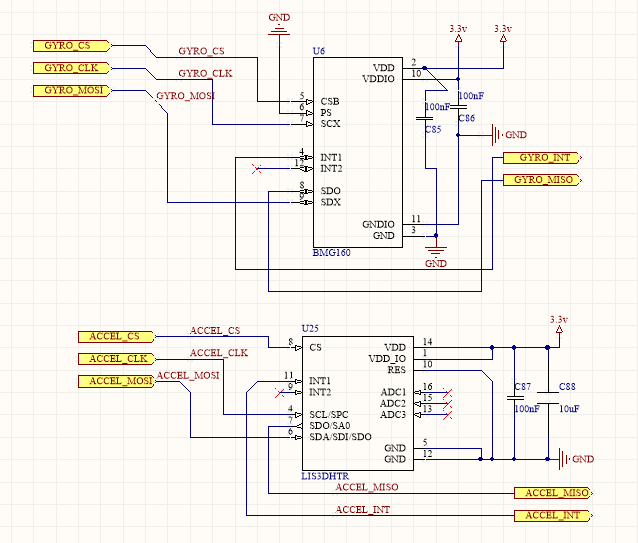

# Getting Started - Electrical System Overview \(WIP\)

## Components Overview

The current system uses three different PCBs, two types of motors, and two solenoids

### PCBs

* [Main board](board-overview.md#main-board)
* [Chicker board](board-overview.md#chicker-board)
* [Breakout board](board-overview.md#breakout-board)

### Electromechanical

* [Chipper and kicker solenoids](board-overview.md#solenoids)
* [Wheel motors](board-overview.md#wheel-motors)
* [Dribbler motor](board-overview.md#dribbler-motor)

### Other

* [LiPo batteries](board-overview.md#lipo-batteries)

## Main Board

### Overview

The main board houses the electronics used for power distribution, control, motor driving, wireless communication, and logging.

### Detailed Description

The main board has several modules:

* Power distribution
* Control electronics
  * The microcontroller
  * The FPGA
* Motor drivers
* IMU
* Radio Communication
* Connectors and Peripherals

#### Power Distribution 

A combination of a toggle switch, semiconductor switches \(MOSFETS\), and firmware control the delivery of power to the electrical system.

_SP3T Toggle Switch_

* 3 states: ON, OFF, START
* Double switch
* Single toggle

_Quick note on P-channel MOSFETs_

* ON: Vgs &gt; -Vth
* OFF: Vgs &lt; -Vth

[See link for more information](https://www.baldengineer.com/p-channel-mosfet-tutorial-with-only-positive-voltages.html).

_OFF state_

When the toggle switch is in the OFF state, the switch pins are aligned 2-3 and 5-6. This connection pulls the gate of the Q28 P-channel MOSFET to the battery. Since the source of Q28 is connected to the battery, Vgs = 0 and therefore is less than the threshold voltage \(Vgs &lt; -Vth\) so Q28 is open \(no current flows\). The source of Q27 is also connected to the battery. The presence of the battery makes the Schottky diode D24 forward biased and so the gate of Q27 is also pulled high and therefore Q27 is open causing no current to flow.

_ON state_

When the toggle switch is in the ON state, the switch pins are aligned 2-3 and 5-4. The 5-4 connection allows firmware to control Q28 via the Q14 N-channel MOSFET since its state is dictated by the LOGIC\_PWR signal from the microcontroller. When the gate of Q28 is grounded via Q14, Q27 becomes under firmware control. So, if the Q15 N-channel MOSFET is switched to its active region \(fully conducting\) via the HV\_PWR signal from the microcontroller, D24 becomes reversed bias \(blocking\) due to the negative potential difference across the P-N junction. This block forms a voltage divider with R53 and R52 which makes the gate potential small and Vgs much larger than the threshold voltage \(Vgs &gt; -Vth, therefore in active mode so fully conducting\).

Vg = Vbatt \* 1k/\(1k+10k\) = 1.34545V to 1.52727 V \(depending on the battery voltage\)

The voltage divider makes the gate potential small and Vgs much larger than the threshold voltage \(active mode, conducting MOSFET etc.\)

_START state_

When the toggle switch is in the START state, the switch pins are aligned 2-1 and 5-4. The 2-1 connection and R8 grounds the gate of Q28 which switches the MOSFET on \(fully conducting/active region\). With the gate of Q28 grounded, Q27 is under firmware control via Q15. This is the same part of the ON state in the case of when the gate of Q28 is grounded.  
  
  

#### Control Electronics 

_The Microcontroller_

\_\_

We use the STM32F4 microcontroller. [See datasheet for more information.](https://www.st.com/content/ccc/resource/technical/document/reference_manual/3d/6d/5a/66/b4/99/40/d4/DM00031020.pdf/files/DM00031020.pdf/jcr:content/translations/en.DM00031020.pdf)

* ARM-Cortex M4

Firmware \(C\) 

* Primitives
* Thermal models
* Motion controller \(Bang Bang\)
* Motor functions
* Encoders
* Hall sensors: calculation of wheel and shaft speeds, reading Hall count values over the ICB
* Sensors: communication between the accelerometer and gyroscope
* ICB management \(Inter-Chip Bus\)
* LEDs
* Radio: initializing the radio and sending and receiving raw frames
* Tick and timing functions
* Chicker: charging, discharging, kicking, chipping
* Break beam

_The FPGA_

We use the Xilinx Spartan-6 FPGA. [See datasheet for more information](https://www.xilinx.com/support/documentation/data_sheets/ds162.pdf).

Embedded Software \(VHDL\)

* Radio packet accelerator
* Reads accelerometer and gyroscope data
* PWM generation for motors
* Read Hall sensor data
* SPI
* Interrupt controller
* Inter-Chip Bus \(ICB\)

#### Motor Drivers

The FPGA generates two PWM signals, HIGH and LOW, with the appropriate duty cycle for a given desired speed. Half-bridge gate drivers are power amplifiers that take low-power control signals as inputs \(FPGA outputs\) and outputs high-current drive input signals that can properly drive power transistors \(e.g. MOSFET or IGBT\). The MOSFETs are used as switches, so they should only be in the active regions \(saturation/conducting: Vgs&gt;Vth\) or off \(non-conducting: Vgs &lt; Vth\). This is to ensure clean transitions from the control logic input to the high-side gate driver. A gate driver’s function is like a combination of a level shifter and an amplifier.

We use the [LM5107 Half-Bridge Gate driver](http://www.ti.com/lit/ds/symlink/lm5107.pdf), which is specifically designed for driving N-Channel MOSFETs in either a low or high side configuration. This allows for the use of only N-Channel MOSFETs in the bridge instead of a combination of a P- and N- channel.

_Case 1: Off_

Both LG0 and HG0 are logic LOW \(GND\). Vgs &lt; Vth so the MOSFETs are off \(non-conducting\).

_Case 2: Drive_

LG0 and HG0 are the level-shifted/amplified PWM signals which will toggle the states of the MOSFETs. Both gates will never be in the active region \(conducting\) at the same time as that could short the battery due to the low Rds\(on\) of MOSFETs in the active region.  

#### The IMU

An inertial measurement unit \(IMU\), is a self-contained system that uses a combination of accelerometers and gyroscopes, and occasionally magnetometers, to measure linear and angular motion. Gyroscopes measure angular velocity and accelerometers measure linear acceleration.

We use the [BMG160 3-Axis Gyroscope](https://www.mouser.com/ds/2/783/BST-BMG160-FL000-01_2012-09-786479.pdf) and the [LISDH 3-Axis MEMS Accelerometer](https://www.st.com/en/mems-and-sensors/lis3dh.html).

The sensor data is read via SPI from the FPGA, and then sent to the MCU through the ICB \(Inter-Chip Bus\)  

#### Radio Communication

We use MRF24J40 RF transceiver chips to communicate between the AI and the robots. See the [MRF chip data sheet](https://ww1.microchip.com/downloads/en/DeviceDoc/39776C.pdf) for more information.

* Packets transmitted/received from/to AI via radio \(MRF chip\) using the Dongle.
* Packets received/transmitted via identical MRF chip on the Main Board.

_Reception_

* FPGA acts as packet accelerator and communicates the instructions and frame length via ICB \(inter-chip bus\) transactions with the microcontroller.
* Once an instruction is received by the microcontroller, the instructions can be executed.

The receive offload engine handles frames arriving over the air. As soon as a frame arrives, it is stored in the MRF24J40’s receive buffer and a receive interrupt is asserted. The offload engine observes the interrupt flag and reads the frame from the MRF24J40’s receive buffer into a second receive buffer in the FPGA. Once this transfer is complete, the offload engine asserts an ICB IRQ, indicating that a received frame is ready to be provided to the microcontroller.  The microcontroller then, at its leisure, issues an ICB transaction to retrieve the length of the frame, then a second transaction to retrieve the frame. The FPGA will only read out a second received frame from the MRF24J40 once the microcontroller has finished retrieving the first frame. However, the MRF24J40 can receive a second frame as soon as the first frame reaches the FPGA’s internal buffer, so the window for dropped frames is very small and does not depend on microcontroller latency. 

_Transmission_

The transmit offload engine handles frames being sent over the air. When the STM32F4 wishes to send a frame, it issues an ICB command to copy the frame data into a buffer in the FPGA. The FPGA then copies the frame over the slower bus to the MRF24J40’s transmit buffer. Once the frame is fully copied into its final location, the FPGA automatically sets the transmit flag, thus sending the frame. When the MRF24J40 is finished trying to transmit, it asserts an interrupt, which the FPGA observes. At this time, the FPGA automatically reads the transmit status register and asserts an ICB IRQ indicating the fact. The microcontroller can then use another ICB transaction to read the retrieved transmit status register value if desired, and begin sending another frame. 

_Notes_

Both offload engines are activated simultaneously by a single ICB transaction. Internally, the FPGA contains an arbiter which ensures the offload engines coexist and share the SPI bus. As long as the microcontroller obeys the protocol for talking to each offload engine individually, the system will operate properly.

**Connectors and Peripherals**

_SD Card_

SD card used for data logging but can also store the bitstream for the FPGA for an alternative method to flashing.

_Other_

* 6x2 female header for the chicker board
  * Charge, Kick, Chip, GND, +Vbat, Voltage \(chicker voltage\)
* H10806-ND breakout board connector
  * Incoming
    * Encoder \(Mx\_ENCODER\[0…1\]\)
    * Hall sensors \(Mx\_HALL\[0…2\]\)
    * Break beam \(BB\_SENSOR\)
    * LPS\_sensor? Light sensor?
  * Outgoing
    * Motor drive signals \(Mx\_PHASEx\)
* Piano keys
  * 2 pins for setting RF channel \(binary\)
  * 3 pins for setting robot number \(binary\)
  * 1 pin for setting to bootload mode
* Blaster cable header
* Breakout board connector

## Chicker Board

### Overview

The chicker board boosts the battery voltage and uses it to drive solenoids to kick and chip.

### **Detailed Description**

Solenoids are used to actuate the kicking and chipping mechanisms. See the [Solenoids](board-overview.md#solenoids) section for more information.

#### Boost Converter

To generate enough current through the solenoids, the battery voltage of 14.8V-16.8V \(4S LiPo battery\) is boosted to 240V. This is done by a DC/DC converter topology called a [boost converter](https://en.wikipedia.org/wiki/Boost_converter). A boost converter uses semiconductor devices \(transistors and diodes\) and energy storage devices \(capacitors and inductors\) to step-up the input voltage. 

#### How a boost converter works

1. The switch \(N-channel MOSFET\) closes and current flows through the inductor and into ground via the source of the MOSFET. The current flow through the inductor stores energy in the form of a magnetic field
2. The switch opens. The inductor resists the reduction in current flow and collapses its magnetic field to force current through the diode and into the capacitor bank. 
3. The switch closes once again which creates a path for current through the capacitor. The collapse of the inductor's magnetic field transfers the inductor's accumulated energy into the capacitor bank. The voltage is boosted as the capacitors resist changes in voltage caused by the voltage spike from the collapsing magnetic field.
4. This process is repeated until the capacitor bank is fully charged.

The image below is an **example** of the inductor current \(purple\) and the capacitor voltage \(green\) of a boost converter during charging. An increase in the capacitor voltage can be seen when the inductor's magnetic field collapses, indicated by the current spike.

## Solenoids

### Overview

To actuate the kicking and chipping mechanisms, solenoids are driven by allowing to current to flow through them. A solenoid is a coil of wire that is used as an electromagnet.

### Detailed Description

The current along the length of the solenoid's coils induces a magnetic field \([Amperes Law](http://hyperphysics.phy-astr.gsu.edu/hbase/magnetic/solenoid.html#c2)\) which then exerts a force on the conductive plunger. The force leads to an acceleration and the plunger is either shot away from or drawn into the solenoid depending on the direction of the current through the solenoid. This force exerted on the plunger is known as a [Lorentz Force](http://hyperphysics.phy-astr.gsu.edu/hbase/magnetic/magfor.html).

For more information, watch this [great video on solenoids](https://www.youtube.com/watch?v=hsoggQOoG4s) or this [forum answer about solenoids](https://www.physicsforums.com/threads/formula-of-solenoid-magnetic-b-field-at-ending-middle-and-outside.828426/)

## Breakout Board

### Overview

The breakout board connects the main board to the motors and break beam.

### Detailed Description

Due to the current motor connectors, a breakout board is necessary to connect the motor drive and feedback signals to the microcontroller. Further, the logic levels of the signals must be shifted to allow communication with the microcontroller.

* Main board connector receptacle
* Level shifter
* Motor drive/Hall sensor connectors
* Encoder connectors

**Main Board Connector Receptacle**

* Mx\_SENSORx are the Mx\_ENCODERx or Mx\_HALLx
* Connects LPS\_sensor and LPSx
* BB\_laser: power the laser for the break beam
* BB\_sensor: allows for monitoring of the break bream

**Level Shifter**

Encoders and Hall sensors powered with +5V and therefore run at a 5V logic level. The microcontroller uses 3.3V logic. To communicate between the different logic levels, a level shifter must be used. The level shifter used is a unidirectional HIGH-to-LOW level shifter. When the input is HIGH \(+5V\) is applied to one of the high-side inputs, 3.3V will appear at the output. Similarly, when the input is LOW \(0V\), 0V will appear at the output.

Note: pull-up resistors on all input signals to the level shifter to maintain signal integrity and pull all high in an idle state.  
****

**Motor Drive/Hall Sensor Connectors**

* HALL\[0…2\]
  * 5V logic
* +5V connection
* GND connection
* PHASE\[0..2\]: PWM signals

**Encoder Connectors**

* ENCODER\[0..1\]
  * 5V logic
* +5V connection
* GND connection

## Wheel Motors

## Dribbler Motor

## LiPo Batteries

