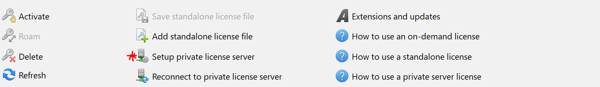
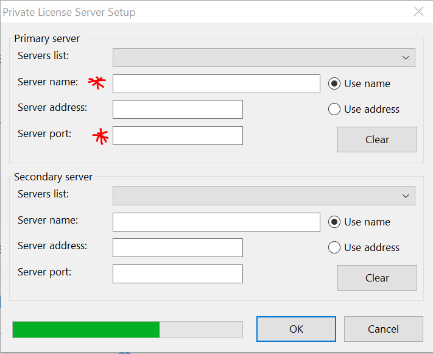
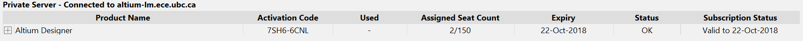
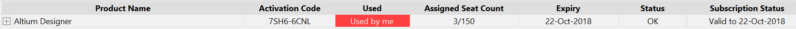

# DEPRECATED

Instructions to install Altium are now located under `2020-2021\Planning\On-Boarding` in the Electrical Subteam Google Drive. Please visit that location to get more up-to-date instructions.

# Getting Started - CAD Software

Setup instructions on how install CAD software for schematic capture and PCB layout.

---
In the past, the team has used KiCAD. However, in the fall of 2017, we began to move all the schematics to Altium. 

## Altium Setup


Altium is only compatible with Windows. We currently use version 16.0. For more information on the system requirements for this version of Altium, go [here](https://www.altium.com/documentation/16.0/display/ADES/Altium+Designer+-+%28%28System+Requirements%29%29).


### ECE Students

#### Part 1 - Installation

1. Go to the [ECE software download site](https://download.ece.ubc.ca/auth/login) and login using your **ECE student credentials** \(NOT the same as your CWL\). If you are in ECE and do not have an ECE account or if you have forgotten your password, go [here](https://help.ece.ubc.ca/How_To_Get_An_Account).
2. Under `Software`, choose `Altium Designer`. Then, under `Release` choose `16`.
3. Read through `README.html`. This document contains instructions on how to install the software and outlines the connection requirements to access the ECE license server.
4. Install the software using either the offline setup \(recommended\) or the executable file.


If installing Altium using the executable file, you must first make an Altium Live account. To do so, go [here](https://live.altium.com/Join). Please note that it may take a few days for Altium to get back to you. 

If you do not see fields to enter your information on the linked page, try a different browser.


#### Part 2 - License Setup

1. If on campus, connect to either **UBCSecure** or **UBCPrivate**. No other wireless network will work. For remote use, you can VPN into the ECE license serve. Go [here ](getting-started-cad-software-wip.md#myvpn-setup)to setup myVPN.
2. Open Altium and select `Setup private license server`.

3.     Fill in the `Server name` and `Server port` with the information from the `README.html` file. The server will be `altium-lm.ece.ubc.ca` but the port is dependent on the current license. Once filled out, click `OK`.

4.    Scroll down under `Available Licenses` until `Private Server`.

5.   Select the license shown in the above photo, and then click `Use`.

6.    If the license setup is successful, it should say `Used by me` under `Used`.


If the connection is not successful, try the following:

If you are on campus, ensure that you are connected to **UBCSecure** or **UBCPrivate**. 

If you are using the license remotely, ensure that you are connected to myVPN. 


### Non-ECE Students

Talk to one of the Electrical leads about getting the software. Once installed, follow the [license setup](getting-started-cad-software-wip.md#part-2-license-setup).

### myVPN Setup

Go [here](https://it.ubc.ca/services/email-voice-internet/myvpn/setup-documents) and follow the instructions. Be sure to go over the information on system compatibility.

## KiCAD Setup


KiCAD is compatible with several operating systems!


To install KiCAD, go [here](http://kicad-pcb.org/download/).
